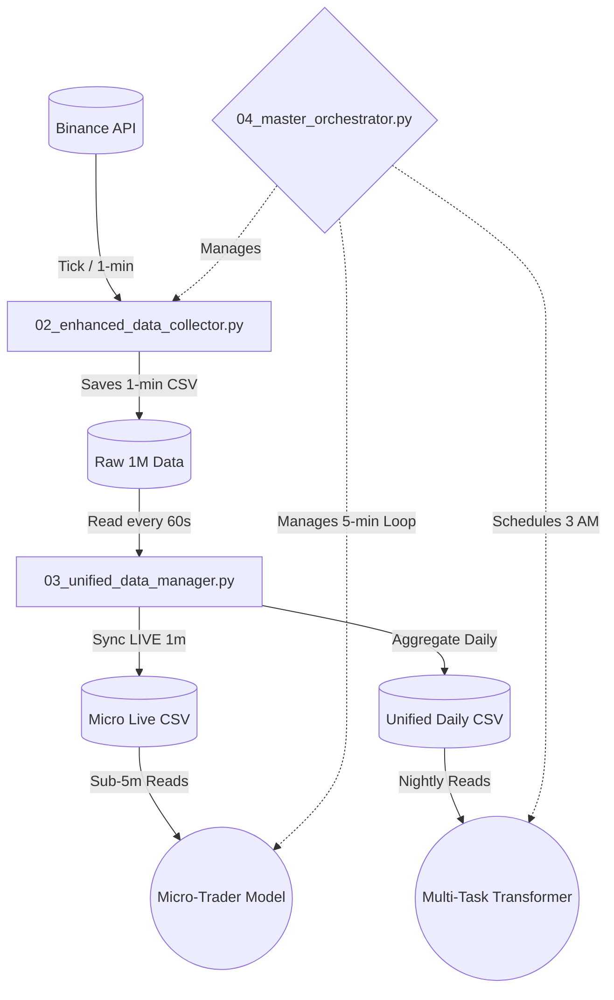

# Complete System Integration Architecture

## Overview
This architecture unifies two distinct trading models into a single, cohesive ecosystem:
1. **Multi-Task Transformer**: Daily predictions (unchanged).
2. **Micro-Trader**: Sub-5-minute real-time trading logic.

Both systems are coordinated through the **Master Orchestrator**, which ensures that data is collected, aggregated, and fed into the models seamlessly.

## Component Architecture

## Core Files Overview

### `01_system_config.json`
Acts as the central truth for interval settings, file paths, and orchestration settings for both systems.

### `02_enhanced_data_collector.py`
Continuously fetches K-lines (klines) from Binance and stores them into the designated `raw` directory.

### `03_unified_data_manager.py`
Acts as the **Shared Data Hub**. It transforms 1-minute ticking data into aggregated daily format, ensuring both the real-time trader and the daily multi-task transformer operate on precisely aligned historical metrics without conflicts.

### `04_master_orchestrator.py`
Spins up both prediction models and data collection as concurrent subprocesses. Ensures that long-running operations like the Multi-Task Transformer training only happen during off-peak hours (e.g., 03:00 AM).

### `05_launch_dual_system.py`
The one entry point that checks dependencies, runs an initial sync, and delegates full control to the Orchestrator.

## Resilience Protocols
- **Auto-Restarts**: Handled by the Master Orchestrator. Subprocesses failing will wait 60 seconds and attempt an auto-restart.
- **Graceful Degradation**: If Binance API goes down, the Data Collector retries on loop. The Manager will skip updating, and models will use the most recent available CSV snapshot safely.
